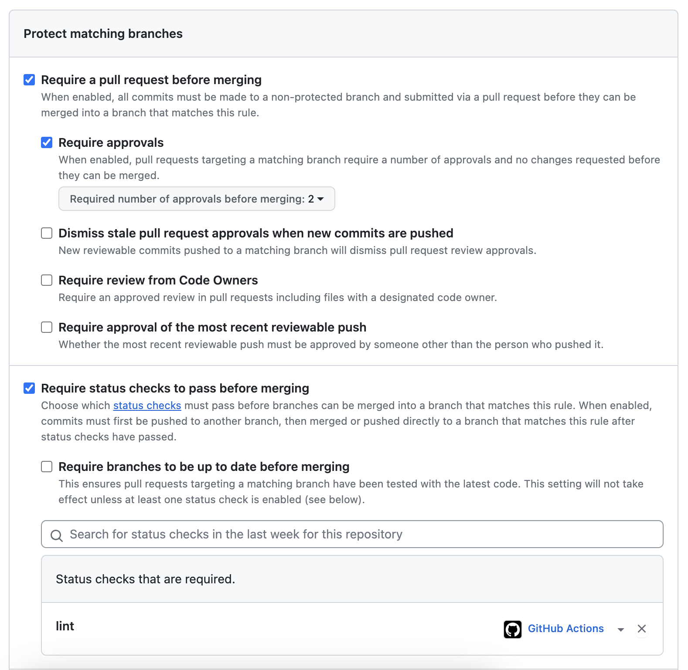

## Setup

The setup is broken into a few different steps to prevent a self-managed ArgoCD from accidentally destroying the "core" foundation (mainly CRDs and namespace). Once setup, the entire setup is managed via changes in this repo.

### (optional) Pre-reqs 

Install any CRDs that you might use OUTSIDE of the ArgoCD automation. This prevents any accidental deletions or chicken/egg problems cleaning up essential resources.

The "critical" CRDs installed are:
- ArgoCD CRDs (Application, ApplicationSet, etc)
- Gateway API (Gateway, HTTPRoute, etc)

```
kubectl kustomize workloads/WIP-00-crds/config/base | kubectl apply -f -
```

## Install / boostrap ArgoCD with Kustomize

Install ArgoCD using kustomize (the preferred method) and then use an ArgoCD Application to wire-up the self-management.

### Step 1:

Install ArgoCD

```
# create namespace outside of workload to prevent deletion on cleanup
kubectl create ns argocd
kubectl kustomize workloads/01-argocd/config/base/ | kubectl apply -f -
```

Wait for pods to be running: `kubectl get pods -n argocd`

### Step 2:

Create GitHub App for ArgoCD auth to GitHub

At this point you have a cluster with Gateway API CRDs and ARGO CD installed. Next, setup GitHub app for interacting with GitHub.

> https://docs.github.com/en/apps/creating-github-apps

IMPORTANT: Grant the app "Commit statuses (read and write)" and "Contents (read only)"

Install it on your repo:


Configure Argo:

```
# https://github.com/settings/apps

export REPO_NAME="https://github.com/jimangel/cd.git"
export GH_APP_ID=########
# go to https://github.com/settings/installations and check the URL in "configure"
# might be different for orgs
export GH_INSTALL_ID=#
export PRIV_KEY_PATH="$HOME/Downloads/argocdbot-512.2023-10-06.private-key.pem"

cat <<EOF | kubectl apply -f -
apiVersion: v1
kind: Secret
metadata:
  name: github-app-repo
  namespace: argocd
  labels:
    argocd.argoproj.io/secret-type: repository
stringData:
  type: git
  url: "${REPO_NAME}"
  githubAppID: "${GH_APP_ID}"
  githubAppInstallationID: "${GH_INSTALL_ID}"
  githubAppPrivateKey: |
$(cat $PRIV_KEY_PATH  | sed 's/^/    /')
EOF
```

> Note: When using GitHub Apps, always use an HTTP URL for "repoURL" (to match here)

### Step 3:

Add ApplicationSet to create apps and enable ArgoCD self-management

```
kubectl apply -f workloads/01-argocd/applicationset/argocd.yaml
```

From this point forward, adding ApplicationSets within the workloads/* directory are discovered by ArgoCD.

## Accessing ArgoCD

Logging in, Get admin password:

```
kubectl -n argocd get secrets argocd-initial-admin-secret \
-o jsonpath='{.data.password}' | base64 -d

kubectl port-forward svc/argocd-server -n argocd 8080:80
```

## Webhook config

Expose /api/webhook (details in "rotate secrets" script for local / ngrok)

```
# Create webhook secret
echo -ne '123HA$H123' | gcloud secrets create gh-webhook-string --data-file=-

echo -ne '{"password2":"itsasecret2"}' | gcloud secrets create gh-webhook-string --data-file=-

export PROJECT_ID=YOUR_PROJECT
gcloud secrets add-iam-policy-binding gh-webhook-string --member "serviceAccount:cloudydemo-secret-admin@$PROJECT_ID.iam.gserviceaccount.com" --role "roles/secretmanager.secretAccessor"

# create external secrets to append

cat <<EOF | kubectl apply -f -
apiVersion: external-secrets.io/v1beta1
kind: ExternalSecret
metadata:
  name: github-webhook-password
  namespace: argocd
spec:
  secretStoreRef:
    kind: ClusterSecretStore
    name: gcp-backend
  target:
    name: argocd-secret
    creationPolicy: Merge
  data:
  - secretKey: "webhook.github.secret"
    remoteRef:
      key: gh-webhook-string
EOF

# validate
kubectl get secret argocd-secret -n argocd -oyaml

export GITHUB_HOOK_URL="https://external-domain.example.com"

# returns 400 because not a "real" webhook event
curl -s -o /dev/null -w "%{http_code}" -d '{}' ${GITHUB_HOOK_URL}

# returns 200 because it's a "real" webhook event (ping)
curl -s -o /dev/null -w "%{http_code}" -H 'X-GitHub-Event: ping' -d '{}' ${GITHUB_HOOK_URL} 

# the first one produces no logs, the second one produces "Ignoring webhook event" in the logs of the argocd-server.

# reboot argocd
```

## Workload breakdown

| Workload Name             | Sync Wave | Sync Type                    | Core Config                                                                                           | Custom Shared Config                                                                                                                                                     | README.md                                             |
|---------------------------|-----------|------------------------------|-------------------------------------------------------------------------------------------------------|--------------------------------------------------------------------------------------------------------------------------------------------------------------------------|-------------------------------------------------------|
| argocd                    | 0         | kustomize                    | [base/](workloads/argocd/config/base/)                                                                | [overlays/](workloads/argocd/config/overlays/) (Metal, GKE)                                                                                                              | [link](workloads/argocd/README.md)                    |
| argorollouts              | 0         | kustomize-remote             | [base/](workloads/argorollouts/config/base/)                                                          | n/a                                                                                                                                                                      | [link](workloads/argorollouts/README.md)              |
| certmanager               | 0         | helm-remote                  | (Helm URL in AppSet)                                                                                  | n/a                                                                                                                                                                      | [link](workloads/certmanager/README.md)               |
| echo-server               | 0         | helm-local                   | [local-helm/](workloads/echo-server/config/local-helm)                                                | n/a                                                                                                                                                                      | [link](workloads/echo-server/README.md)               |
| external-secrets-operator | 0         | helm-remote                  | (Helm URL in AppSet)                                                                                  | n/a                                                                                                                                                                      | [link](workloads/external-secrets-operator/README.md) |
| gatekeeper                | 0         | helm-remote-plus-yaml-local  | (Helm URL in AppSet), [raw/](workloads/gatekeeper/config/raw/) (yaml)                                        | n/a                                                                                                                                                                      | [link](workloads/gatekeeper/README.md)                |
| gateway-api-crds          | -1        | kustomize-remote             | [base/](workloads/gateway-api-crds/config/base/)                                                      | [overlays/](workloads/gateway-api-crds/config/overlays/) (Staging)                                                                                                       | [link](workloads/gateway-api-crds/README.md)          |
| gateway-api-istio-ingress | 0         | kustomize                    | (GitHub URL in AppSet)                                                                                | [overlays/](workloads/gateway-api-istio-ingress/config/overlays/) (Staging)                                                                                              | [link](workloads/gateway-api-istio-ingress/README.md) |
| oss-istio                     | 0         | kustomize-nested-helm-remote | [base/](workloads/istio/config/base/)                                                        | [overlays/](workloads/istio/config/overlays/) (Not In Use)                                                                                                               | [link](workloads/istio/README.md)                     |
| kube-prometheus-stack     | 0         | helm-remote-plus-helm-local  | (Helm URL in AppSet) | [environments/](workloads/kube-prometheus-stack/applicationset/environment) (Prod / Staging), ([addon-chart-gateway/](workloads/kube-prometheus-stack/config/addon-chart-gateway) & [helm-values/](workloads/kube-prometheus-stack/config/helm-values)) | [link](workloads/kube-prometheus-stack/README.md)     |
| metrics-server            | 0         | helm-remote                  | (Helm URL in AppSet)                                                                                  | n/a                                                                                                                                                                      | [link](workloads/kube-prometheus-stack/README.md)     |

## Important concepts
- IF YOU USE IT, LABEL IT (label application CRDs with the selectors used so it's easy to debug ... for filtering, searching, etc)
- flat structure for easy debugging (clusters or workloads)
- clusters opt-in to workloads
- the config for workloads should be similar in structure
  - kustomize have base / overlays
  - helm has values files for env
- do yourself a favor, document how to test local workloads in the folder (README.md).
  - Include why's, hows, and whats
  - Maybe include a bash one-liner to show what values are used (grep + bash on the cluster struct or appset)

Best approach is creating a lower environment and playing "wide open"


## How to debug workloads

```
# TODO: debugging workloads (flowchart)

# helpful to look at the appset controller logs (# of apps synced)
kubectl -n argocd logs -f -l app.kubernetes.io/name=argocd-applicationset-controller

# helpful to get the most recent status of events (maybe template issue.)
kubectl get appset self-managed-argocd -n argocd -o yaml
```

## Adding additional workloads (flowchart)

Maybe create 2 flow charts (creating workloads, debugging workloads)

- leave as much "defaults" as you can (copy upstream repos with regular sync / diff audit)
- try to avoid unused files or resources
- try to avoid confusing names
- try to avoid deviating too far from the standard ops (like creating too many selectors or assuming new ways to selects apps)
- important to keep it as simple as possible
  - unique cluster env in dir/yaml
  - shared cluster(s) env in workloads/*/config
  - unique application configuration in workloads/*/applicationset
  - by design, applicationsets should be horizontally scaleable (adding new clusters can opt-in and inherit accordingly)
- pay attention to resource management (prune vs. not + appset vs app pruning + secrets)
- Include a bit about ignoreDifferences and when it comes into play.

## Adding additional clusters

Since the first install we "bootstrapped," adding new clusters is a matter of:
- Create the config file yaml in `cluster/`
- Add the connection information to a secret in ArgoCD
- Sync!

### Adding GKE Connect Clusters

```
export Project ID

# create fleet service account for interacting with the clusters
gcloud iam service-accounts create argocd-fleet-admin --project $PROJECT_ID

gcloud projects add-iam-policy-binding $PROJECT_ID --member "serviceAccount:argocd-fleet-admin@${PROJECT_ID}.iam.gserviceaccount.com" --role roles/gkehub.gatewayEditor
```

## Fork this approach

TBD (one:one / one:many / take-what-you-need)

## Trouble

https://argo-cd.readthedocs.io/en/stable/faq/#argo-cd-is-unable-to-connect-to-my-cluster-how-do-i-troubleshoot-it

## Blast radius

Security branch settings / lint requirements:



## TODO

- improve workload selection / declaration + helm values (https://github.com/argoproj/argo-cd/issues/11982 - allow selector + nested helm workload values )
- create secrets rotation / creation tooling
- update external secrets to use helm values (simplify setup): https://external-secrets.io/v0.7.0/api/secretstore/
- Document the service accounts used in GCP / dns a bit better (gcloud iam service-accounts create cloudydemo-dns01-solver + GCP GSM)
- Move certmanager secret to git (`kubectl -n cert-manager create secret generic clouddns-dns01-solver-svc-acct --from-file=$HOME/key.json`)
  - Add additional certmanager resources to workload (cluster issuer, wildcard requests, etc)
- move `environments` config for appset into "config" directory and update kube-prometheus-stack
- rename or append 01, 02 to high priority workloads / sync wave (like argoCD -> secrets -> istio -> gateway -> certs etc)