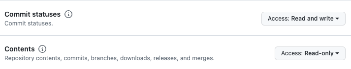
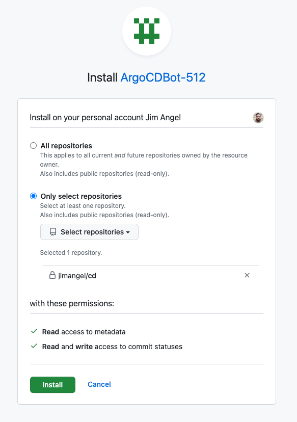
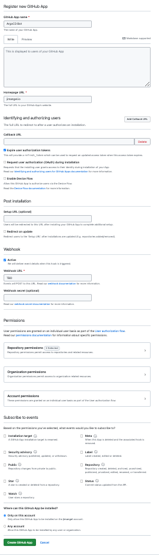

## Install argo

TODO:

- add a makefile to lint cluster values for duplicates (cluster name / server / etc)
- improve workload selection / declaration + helm values (https://github.com/argoproj/argo-cd/issues/11982 - allow selector + nested helm workload values )
- add gatekeeper locks to workload definitions
- create secrets rotation / creation tooling
- update external secrets to use helm values (simplify setup): https://external-secrets.io/v0.7.0/api/secretstore/
- Document the service accounts used in GCP / dns a bit better (gcloud iam service-accounts create cloudydemo-dns01-solver + GCP GSM)
- Move any/all CRDs to a [separate ApplicationSet](https://helm.sh/docs/chart_best_practices/custom_resource_definitions/#install-a-crd-declaration-before-using-the-resource)
- Warn and fix any gotemplates with no value (using defaults)
- Use sync waves at the Application and ApplicationSet level to order (like Gateway after Istio)
- Move certmanager secret to git (`kubectl -n cert-manager create secret generic clouddns-dns01-solver-svc-acct --from-file=$HOME/key.json`)
  - Add additional certmanager resources to workload (cluster issuer, wildcard requests, etc)
- Add support for workload ID (certmanager, argo, etc)
- Validate that domains are not hardcoded/set in any low-level yaml
- Move HTTPRoutes to respective workload folders (currently created out of band)
- Diagram areas of importance
- Markdown table outlining the key areas of a few example workloads (links to specific areas outlining the flow)
- Identify / diagram non-obvious points of automation (argo-self, repo structure for appset auto-deploy, to delete or not to delete app vs appset, what triggers or syncs when)
- switch local service account secrets to GSM + External Secrets manager and update readme / setup

## What this is ("What you get")

TBD

## Important concepts
- IF YOU USE IT, LABEL IT (label application CRDs with the selectors used so it's easy to debug ... for filtering, searching, etc)
- flat structure for easy debugging (clusters or workloads)
- clusters opt-in to workloads
- the config for workloads should be similar in structure
  - kustomize have base / overlays
  - helm has values files for env
- do yourself a favor, document how to test local workloads in the folder (README.md).
  - Include why's, hows, and whats
  - Maybe include a bash one-liner to show what values are used (grep + bash on the cluster struct or appset)

Best approach is creating a lower environment and playing "wide open"

## Install / boostrap ArgoCD with Kustomize

```
kubectl kustomize workloads/argocd/config/overlays/staging/ | kubectl apply -f -
```

Check pods are running: `kubectl get pods -n argocd`

## Create GitHub App for ArgoCD auth to GitHub

> https://docs.github.com/en/apps/creating-github-apps

```
# https://github.com/settings/apps

# New GitHub App

# Under "Homepage URL", type the full URL to your app's website. If you don’t have a dedicated URL and your app's code is stored in a public repository, you can use that repository URL. Or, you can use the URL of the organization or user that owns the app.

# For Repo Permissions
# Commit statuses (read / write) -> allows for updating CI status via GHA

# disabled webhook for now and installed on my repos
```

NOTE: added "contents" in addition for permissions (THIS IS IMPORTANT!!):







## Setup git repo to use GitHub App credentials

```
export REPO_NAME="https://github.com/jimangel/cd.git"
export GH_APP_ID=########
# go to https://github.com/settings/installations and check the URL in "configure"
# might be different for orgs
export GH_INSTALL_ID=#
export PRIV_KEY_PATH="$HOME/Downloads/argocdbot-512.2023-10-06.private-key.pem"

cat <<EOF | kubectl apply -f -
apiVersion: v1
kind: Secret
metadata:
  name: github-app-repo
  namespace: argocd
  labels:
    argocd.argoproj.io/secret-type: repository
stringData:
  type: git
  url: "${REPO_NAME}"
  githubAppID: "${GH_APP_ID}"
  githubAppInstallationID: "${GH_INSTALL_ID}"
  githubAppPrivateKey: |
$(cat $PRIV_KEY_PATH  | sed 's/^/    /')
EOF
```

Note: When using GitHub Apps, always use an HTTP URL for "repoURL" (to match here)

## Add ApplicationSet to create apps and enable ArgoCD self-management

```
# Install self-managing bootstrap chart:
kubectl apply -f workloads/argocd/applicationset/argocd.yaml
```

From this point forward, adding ApplicationSets within the workloads/* directory are discovered by argocd (after sync).

## Accessing ArgoCD

Logging in:

```
# Get admin password
kubectl -n argocd get secrets argocd-initial-admin-secret \
-o jsonpath='{.data.password}' | base64 -d

kubectl port-forward svc/argocd-server -n argocd 8080:80
```

## Webhook config

Expose /api/webhook (details in "rotate secrets" script for local / ngrok)

```
# Create webhook secret
echo -ne '123HA$H123' | gcloud secrets create gh-webhook-string --data-file=-


echo -ne '{"password2":"itsasecret2"}' | gcloud secrets create gh-webhook-string --data-file=-


export PROJECT_ID=YOUR_PROJECT
gcloud secrets add-iam-policy-binding gh-webhook-string --member "serviceAccount:cloudydemo-secret-admin@$PROJECT_ID.iam.gserviceaccount.com" --role "roles/secretmanager.secretAccessor"


# create external secrets to append


cat <<EOF | kubectl delete -f -
apiVersion: external-secrets.io/v1beta1
kind: ExternalSecret
metadata:
  name: github-webhook-password
  namespace: external-secrets
spec:
  secretStoreRef:
    kind: ClusterSecretStore
    name: gcp-backend
  target:
    name: argocd-secret
    creationPolicy: Merge
  data:
  - secretKey: webhook.github.secret
    remoteRef:
      key: gh-webhook-string
EOF


# validate
kubectl get secret argocd-secret -n argocd -oyaml


# reboot argocd
```

## How to debug workloads

```
# TODO: debugging workloads (flowchart)

# helpful to look at the appset controller logs (# of apps synced)
kubectl -n argocd logs -f -l app.kubernetes.io/name=argocd-applicationset-controller

# helpful to get the most recent status of events (maybe template issue.)
kubectl get appset self-managed-argocd -n argocd -o yaml
```

## Adding additional workloads (flowchart)

Maybe create 2 flow charts (creating workloads, debugging workloads)

- leave as much "defaults" as you can (copy upstream repos with regular sync / diff audit)
- try to avoid unused files or resources
- try to avoid confusing names
- try to avoid deviating too far from the standard ops (like creating too many selectors or assuming new ways to selects apps)
- important to keep it as simple as possible
  - unique cluster env in dir/yaml
  - shared cluster(s) env in workloads/*/config
  - unique application configuration in workloads/*/applicationset
  - by design, applicationsets should be horizontally scaleable (adding new clusters can opt-in and inherit accordingly)
- pay attention to resource management (prune vs. not + appset vs app pruning + secrets)
- Include a bit about ignoreDifferences and when it comes into play.

## Adding additional clusters

Since the first install we "bootstrapped," adding new clusters is a matter of:
- Create the config file yaml in `cluster/`
- Add the connection information to a secret in ArgoCD
- Sync!

### Adding a cluster with argocd cli:

```
curl -sSL -o argocd-linux-amd64 https://github.com/argoproj/argo-cd/releases/latest/download/argocd-linux-amd64
sudo install -m 555 argocd-linux-amd64 /usr/local/bin/argocd
rm argocd-linux-amd64
```

### Adding GKE Connect Clusters

```
export Project ID

# create fleet service account for interacting with the clusters
gcloud iam service-accounts create argocd-fleet-admin --project $PROJECT_ID

gcloud projects add-iam-policy-binding $PROJECT_ID --member "serviceAccount:argocd-fleet-admin@${PROJECT_ID}.iam.gserviceaccount.com" --role roles/gkehub.gatewayEditor
```

## Login

Get admin password and login:

```
# login to argocd
argocd login --port-forward --port-forward-namespace=argocd --kube-context [ARGOCD_KUBE_CONTEXT]
```

Use argocd cli and kubeconfig context to add cluster(s)

```
# TODO: Connect gateway

# update context via getting new credentials
gcloud container clusters get-credentials CLUSTER_NAME --zone CLUSTER_ZONE --project PROJECT

# https://argo-cd.readthedocs.io/en/stable/user-guide/commands/argocd_cluster_add/
kubectl config get-contexts

argocd --port-forward --port-forward-namespace=argocd --kube-context [ARGOCD_KUBE_CONTEXT] cluster add [TARGET_CLUSTER_CONTEXT]
```

## Fork this approach

TBD (one:one / one:many / take-what-you-need)

## Trouble

https://argo-cd.readthedocs.io/en/stable/faq/#argo-cd-is-unable-to-connect-to-my-cluster-how-do-i-troubleshoot-it