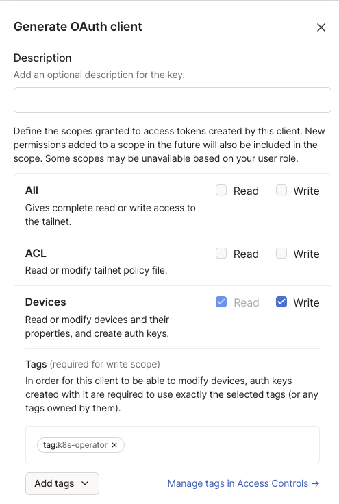

### setup

Source: 
https://tailscale.com/kb/1236/kubernetes-operator/
https://github.com/tailscale/tailscale/blob/main/cmd/k8s-operator/manifests/operator.yaml

kubectl apply -f manifest.yaml

curl <your file url> | kubectl apply -f -

```
Had to:
"tagOwners": {
   "tag:k8s-operator": [],
   "tag:k8s": ["tag:k8s-operator"],
}
```

create oauth client...





```
export TAILSCALE_CLIENT_ID="ss"
export TAILSCALE_CLIENT_SECRET=""

curl -L https://raw.githubusercontent.com/tailscale/tailscale/main/cmd/k8s-operator/manifests/operator.yaml | sed -e "s/# SET CLIENT ID HERE/\"${TAILSCALE_CLIENT_ID}\"/g" -e "s/# SET CLIENT SECRET HERE/\"${TAILSCALE_CLIENT_SECRET}\"/g" | kubectl apply -f -
```

Verify that the Tailscale operator has joined your tailnet. Open the Machines page of the admin console and look for a node named tailscale-operator, tagged with the tag:k8s-operator tag. It may take a minute or two for the operator to join your tailnet, due to the time required to download and start the container image in Kubernetes.

## Test

Patch an existing service with the tailnet settings.

```
kubectl patch svc argocd-server -n argocd --type='json' -p='[{"op": "replace", "path": "/spec/type", "value": "LoadBalancer"}, {"op": "add", "path": "/spec/loadBalancerClass", "value": "tailscale"}]'
```